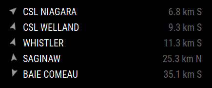

# MMM-MarineTraffic

*MMM-MarineTraffic* is a module for [MagicMirror²](https://github.com/MagicMirrorOrg/MagicMirror) that displays marine traffic (such as boats and freighters) near a configured location.

## Screenshot



## Installation

### Install

In your terminal, go to the `modules` directory and clone the repository:

```bash
cd ~/MagicMirror/modules
git clone https://github.com/owenfromcanada/MMM-MarineTraffic.git
```

### Update

In your terminal, go to the `modules` directory and pull the latest changes:

```bash
cd ~/MagicMirror/modules
git pull
```

## Configuration

To use this module, you have to add a configuration object to the modules array in the `config/config.js` file.

### API Key

This module uses [aisstream.io](https://aisstream.io/) to retrieve data.  You will need to sign up for your own API key.

### Example configuration

Minimal configuration to use the module:

```js
		{
			module: "MMM-MarineTraffic",
			position: "middle_center",
			config: {
        // get your own API key at https://aisstream.io/
				apiKey: "YOURAPIKEYGOESHERE"
			}
		},
```

Configuration with all options:

```js
		{
			module: "MMM-MarineTraffic",
			position: "middle_center",
			config: {
        // get your own API key at https://aisstream.io/
				apiKey: "YOURAPIKEYGOESHERE",

        maximumEntries: 10,

        // whether to show stopped/docked vessels, or only those in motion
        underwayOnly: false,

        // using a precise compass will include 16 points of direction (e.g., NNW), otherwise use only 8 points
        preciseCompass: false,

        // time after which unupdated entries are removed
        purgeAfter: 600, // in seconds

        // either specify a center point and radius
        lat: 51.011998,
        lon: 1.488079,
        radius: 30, // in km

        // or specify specific borders (the reference point will be the center of this area)
        lat1: null,
        lat2: null,
        lon1: null,
        lon2: null,
			}
		},
```

## License

This project is licensed under the MIT License - see the [LICENSE](./LICENSE.md) file for details.

## Changelog

All notable changes to this project will be documented in the [CHANGELOG.md](./CHANGELOG.md) file.
